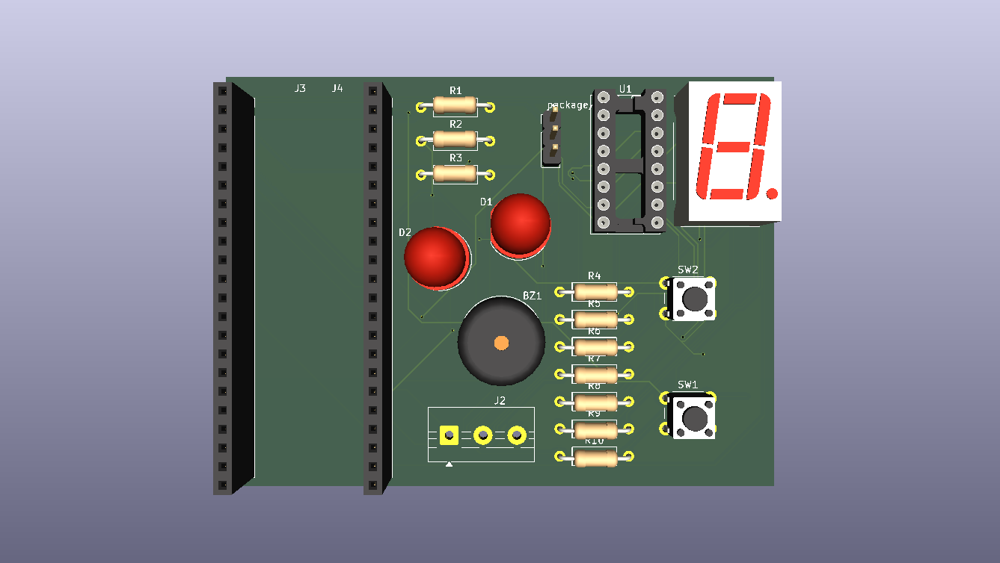

# 🛡️ FPGA 안전 제어기 (gpio-control)

지게차 전자 단말(Pi)이 죽거나 통신이 끊겨도 **경고 표시(LED/부저/7세그)와 전진 차단만큼은
하드웨어로 계속 보장**하는 것을 목표로 하는 최종 안전 방어선입니다. Gowin `GW1NSR-4C`
(GW1NSR-LV4CQN48PC6/I5) FPGA에 Verilog RTL로 구현했습니다.

FPGA는 위험도를 "계산"하지 않습니다 — 계산은 서버가 하고, FPGA는 그 결과를 받아
**우선순위 판단 + 타이밍 제어 + 물리 출력**만 담당합니다.

---

## 📂 디렉터리 구조

```text
gpio-control/
├── src/                        # Verilog RTL + 테스트벤치 + 프로토콜 문서
│   ├── top.v                   # 최상위 모듈 (전체 배선)
│   ├── packet_parser.v         # UART 4바이트 명령 프레임 파싱 + 체크섬 검증
│   ├── warning_fsm.v           # 6단계 우선순위 상태 머신 (SAFE~ESTOP)
│   ├── watchdog.v              # 500ms Pi 통신 두절 감지
│   ├── warning_latch.v         # 위험도 상승 즉시 / 하강 2000ms 지연
│   ├── estop_latch.v           # 비상정지 래치 (무제한, 수동 리셋 전까지)
│   ├── movement_cutoff_latch.v # 전진 차단 릴레이 래치
│   ├── event_detector.v        # 상태 변화 → 이벤트 코드 생성
│   ├── event_tx_fifo.v         # 8-depth 이벤트 전송 큐
│   ├── event_uart_tx.v         # 5바이트 push 프레임 조립
│   ├── heartbeat_gen.v         # 200ms 주기 상태 요약 heartbeat
│   ├── led_pattern.v / buzzer_ctrl.v / self_test_controller.v
│   ├── uart_rx.v / uart_tx.v
│   ├── tb_*.v                  # 테스트벤치 (tb_cutoff, tb_top, tb_post)
│   ├── PROTOCOL.md             # UART 프로토콜 규격서 (필독)
│   └── uart_rx.cst             # 핀 배치 제약 파일
├── hardware/                   # KiCad 프로젝트 (회로도 + PCB)
├── docs/                       # 아키텍처 다이어그램, 회로도/PCB PDF·이미지
├── wireless_relay/             # nRF24L01 + STM32 무선 릴레이 확장
│   ├── PROTOCOL_WIRELESS.md
│   ├── common/                 # 양쪽 보드 공용 (nRF24L01 드라이버, 프레임 검증)
│   ├── tx_node/                # FPGA UART 탭 → 무선 송신
│   └── rx_node/                # 무선 수신 → 릴레이 GPIO + 워치독
└── FPGA_control.gprj           # Gowin EDA 프로젝트 파일
```

---

## 🧠 핵심 아키텍처



```
Pi → [uart_rx] → [packet_parser] → risk_level ──▶ warning_latch ──▶ effective_risk ─┐
                                    (checksum 검증)  (상승즉시/하강2000ms)            │
                                                                                      ▼
estop_n ─▶ estop_filter ─▶ estop_latch ──▶ estop_active ───────────────────▶ warning_fsm
                           (manual_reset_n으로 해제)                          (6단계 우선순위)
                                  │                                                  │
                                  └──▶ movement_cutoff_trigger ──▶ movement_cutoff_latch
                                       (estop_active ∥ CRITICAL)      └─▶ fwd_cutoff_relay_en

warning_state → led_pattern / buzzer_ctrl / warning_state_bcd(7세그)

(상태 변화 or 200ms) → event_detector/heartbeat_gen → event_tx_fifo → event_uart_tx → Pi
```

**의도적 설계 포인트**: `movement_cutoff_trigger`는 CRITICAL·ESTOP만 보고 `COMM_ERROR`는
제외했습니다 — 통신 두절만으로는 전진 차단까지 가지 않고 표시(`warning_state`)에만
반영됩니다(팀 결정, `PROTOCOL.md` §3.2).

---

## 📡 통신 프로토콜 요약

자세한 내용은 [`src/PROTOCOL.md`](src/PROTOCOL.md) 참고.

**Pi → FPGA** (4바이트, 3종류): `[0xAA][command][data][checksum]`
| command | 이름 | 주기 |
|---|---|---|
| 0x01 | SET_RISK | 100ms마다 반복 (watchdog 갱신은 이것만 함) |
| 0x02 | CLEAR_ERROR | 필요할 때 1회 |
| 0x03 | SELF_TEST | 필요할 때 1회 |

**FPGA → Pi** (5바이트, push): `[0x55][event_code][event_detail][seq/overflow/cutoff][checksum]`
- heartbeat 200ms 주기 + 상태 변화 이벤트, 요청-응답 없이 FPGA가 스스로 전송
- checksum = XOR(byte0..3)

---

## 🔧 하드웨어

- **FPGA**: Gowin `GW1NSR-4C` (GW1NSR-LV4CQN48PC6/I5)
- **회로도/PCB**: [`hardware/`](hardware/) (KiCad 프로젝트), 내보낸 문서는
  [`docs/FPGA_control_scematic.pdf`](docs/FPGA_control_scematic.pdf),
  [`docs/FPGA_control_pcb_layout.pdf`](docs/FPGA_control_pcb_layout.pdf)
- **물리 출력**: LED ×2, 부저, 7세그(SN74LS47N BCD 디코더), 스위치 ×2(E-Stop/수동리셋)
- **무선 릴레이 확장**: 전진 차단 릴레이를 nRF24L01 + NUCLEO-F401RE ×2로 무선 구간
  확장. 250kbps, 오토재전송 15회, 600ms(heartbeat×3) 워치독 — 링크 끊김·부팅직후 등
  애매한 상황은 전부 안전 쪽(강제 컷오프)으로 수렴. 자세한 내용은
  [`wireless_relay/PROTOCOL_WIRELESS.md`](wireless_relay/PROTOCOL_WIRELESS.md).

---

## ✅ 검증

**시뮬레이션**: `src/tb_cutoff.v`을 Icarus Verilog로 실행해 6개 시나리오(SAFE, CRITICAL
래치, SAFE 복귀해도 래치 유지, 2000ms hold-down 이후에도 유지, manual_reset 해제,
700ms watchdog timeout 중 래치 유지)를 실측 검증했습니다.

```bash
iverilog -g2012 -o sim.vvp -s tb_cutoff \
  src/tb_cutoff.v src/top.v src/uart_rx.v src/uart_tx.v src/packet_parser.v \
  src/warning_fsm.v src/watchdog.v src/warning_latch.v src/estop_filter.v \
  src/estop_latch.v src/movement_cutoff_latch.v src/led_pattern.v \
  src/buzzer_ctrl.v src/event_detector.v src/event_tx_fifo.v src/event_uart_tx.v \
  src/self_test_controller.v src/heartbeat_gen.v src/button_debounce.v
vvp sim.vvp
```

**합성/배치·배선 (Gowin P&R)**: LUT 999/4,608(22%), Register(FF) 591/3,573(17%),
Setup/Hold 위반 0건(1,658개 경로 분석). ⚠️ 클럭 주파수를 명시적으로 제약하지 않아
Gowin이 기본값(50MHz)으로 분석한 결과이며, 실제 보드 클럭(27MHz, `top.v`
`CLK_FREQ_HZ` 기본값)보다 훨씬 빠른 조건이라 실사용 여유는 충분하지만, 엄밀한
검증을 위해서는 `.cst`에 27MHz 기준 `create_clock` 제약을 추가하는 것을 권장합니다.

---

## 🛠️ 빌드

Gowin EDA(V1.9.11.03 Education 이상)에서 `FPGA_control.gprj` 열기 → Synthesize →
Place & Route → Program Device.
